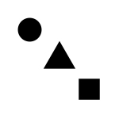

# Optical Illusions

A very early&hellip;

- Library
- Application
- Utilities

## Roadmap

### Library
- [ ] Typescript + upcoming [d3.js 4.0](https://github.com/d3)
- [ ] procedural and parametrized
- [ ] scalable and resizable
- [ ] printable
- [ ] standalone
- [ ] Inkscape compatible
- [ ] illusion metadata and credits
- [ ] reveal feature
- [ ] browser and node
- [ ] L10N

### Application
- [ ] AngularJS + Material Design
- [ ] web
- [ ] mobile?
- [ ] search
- [ ] L10N

### Utilities
- [ ] Atom feed
- [ ] SVG
- [ ] PNG
- [ ] GIF (GraphicsMagick?)
- [ ] SVG poster?
- [ ] L10N
- [ ] pseudo L10N

### Development
- [ ] minimal d3.js build (d3-bundler)
- [ ] minimal Typescript build (noEmitHelpers)
- [ ] gulp
- [ ] tslint
- [ ] editorconfig
- [ ] clang format
